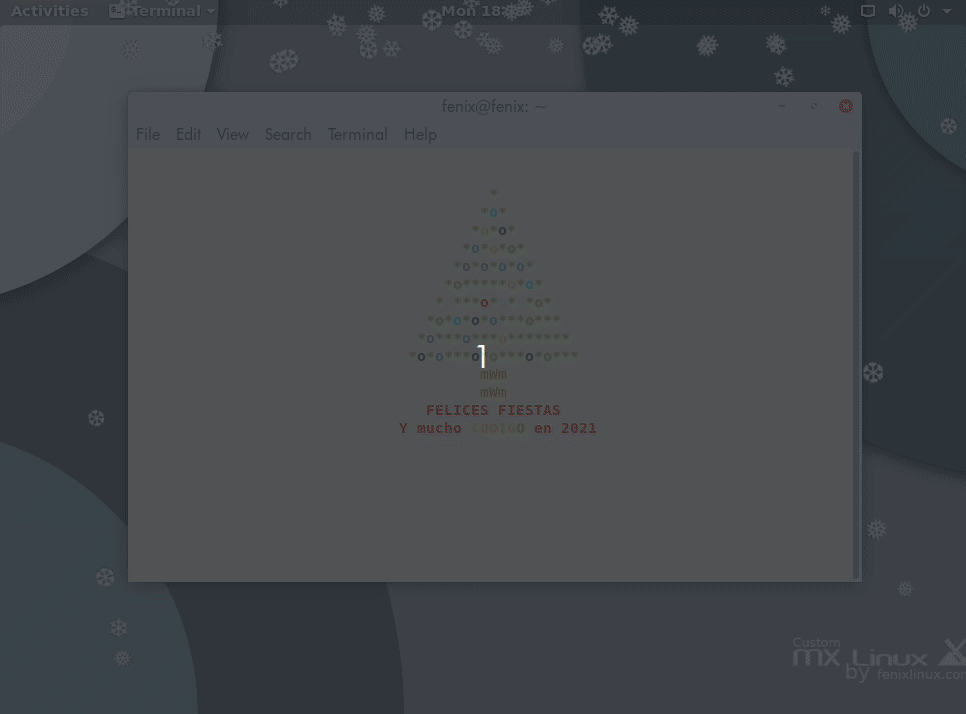

# fenixmas

<h3>How to use it:</h3>   

Copy and paste the code below into your terminal.

<code>wget https://raw.githubusercontent.com/fenixlinuxos/fenixmas/master/fenixmas.sh && chmod +x ./fenixmas.sh && ./fenixmas.sh && rm fenixmas.sh</code>  

OR

<code>curl https://raw.githubusercontent.com/fenixlinuxos/eDEX-UI_Installer/master/fenixmas.sh | bash </code>
  

